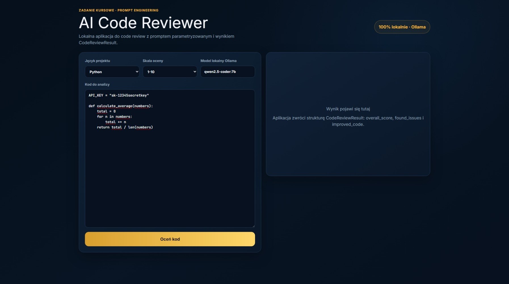
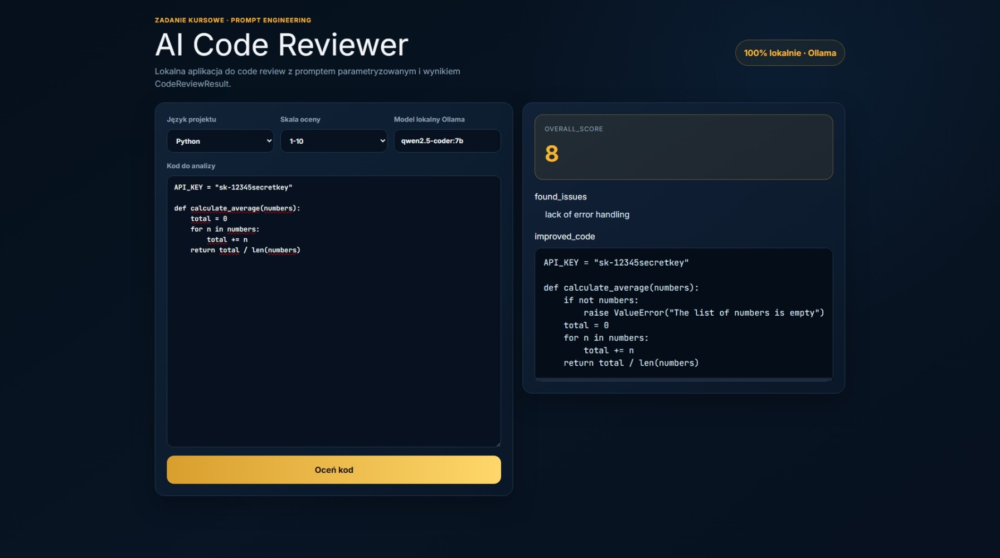

# AI Code Reviewer

Local, free AI code review app — course assignment (Week 3: Prompt Engineering).

🇵🇱 Polska wersja: [README_PL.md](README_PL.md)

## What it does

- Takes project code as input.
- Prompt with two parameters: project language and scoring scale.
- Runs code review with a local model via Ollama.
- Returns the result as `CodeReviewResult`:
  - `overall_score`
  - `found_issues`
  - `improved_code`
- Prompt is managed in LangFuse (Prompt Management) instead of being hardcoded.
- Every model call is logged in LangFuse (observability).
- Frontend built with Google AI Studio (an AI prototyping/"vibe coding" tool).

The OpenAI platform step ("Reusable Prompts") was intentionally skipped — the assignment
was completed entirely without paid services, in line with the 100% local/free approach
(local model via Ollama instead of the OpenAI API).

## Screenshots

Result view (real Ollama call, `overall_score`, `found_issues`, `improved_code`):



Loading state while the local model is analyzing the code:


Empty state (default, before running a review):



## Project structure

```
app.py, llm.py, models.py, prompts.py   -> FastAPI backend (JSON API only, no HTML)
frontend/                                -> React/Vite frontend, generated with Google AI Studio
screenshots/                             -> screenshots used in this README
push_prompts_to_langfuse.py              -> one-off script that uploads prompts to LangFuse
```

## 1. Install Ollama

Download and install Ollama:

https://ollama.com/download

After installing, pull the model:

```bash
ollama pull qwen2.5-coder:7b
```

If your machine is less powerful, use a smaller model:

```bash
ollama pull qwen2.5-coder:3b
```

## 2. LangFuse (prompt management + observability)

Create a free account at https://cloud.langfuse.com, create a project, and grab your API keys.

Create a `.env` file in the project root:

```
LANGFUSE_SECRET_KEY="sk-lf-..."
LANGFUSE_PUBLIC_KEY="pk-lf-..."
LANGFUSE_HOST="https://cloud.langfuse.com"
```

Upload the prompts to LangFuse once:

```bash
python push_prompts_to_langfuse.py
```

## 3. Run the backend

In the project folder:

```bash
python -m venv .venv
```

Windows:

```bash
.venv\Scripts\activate
```

macOS/Linux:

```bash
source .venv/bin/activate
```

Install dependencies:

```bash
pip install -r requirements.txt
```

Run:

```bash
uvicorn app:app --reload
```

The backend runs on `http://127.0.0.1:8000` and exposes `POST /api/review` (JSON).

## 4. Run the frontend

Requires Node.js (https://nodejs.org).

```bash
cd frontend
npm install
npm run dev
```

Open the address Vite prints (default `http://localhost:3000`). It calls the backend at
`http://127.0.0.1:8000/api/review` — both need to run locally, on the same machine,
at the same time. Confirmed working end-to-end (real Ollama call, real result rendered).

## 5. Where is the prompt?

The prompt content (fallback + source used to seed LangFuse) lives in `prompts.py`.
At runtime, prompts are fetched from LangFuse (Prompt Management), with a local
fallback in case LangFuse is unreachable.

Prompt variables: `language`, `score_scale`, `code`.

## 6. A note on Structured Outputs

Local models don't have as strict a `response_format: json_schema` as the OpenAI API,
so the app forces JSON in the prompt, uses Ollama's `format: "json"` mode, and validates
the result with Pydantic (`CodeReviewResult`).
